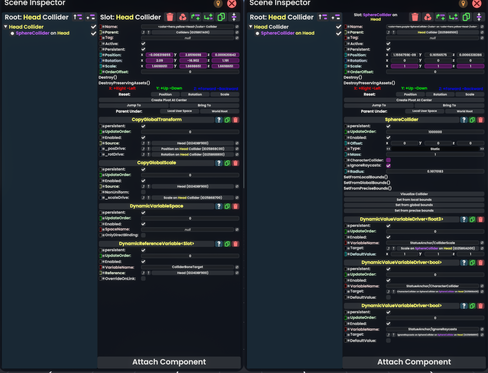

# Resonite Statue Remastered System
###### Updated for Version 1.14.0 (July 2026)
This guide documents complete "how to use" information for the Statue Remastered system on Resonite. It is organized into the following sections:

1. [Document Summary](#document-summary)
  - [Document Changes Since Last Release](#document-changes-since-last-release)
2. [A Brief Note On Consent](#a-brief-note-on-consent)
3. [General System Overview](#general-system-overview)
4. [Available Dynamic Impulses and Their Uses](#available-dynamic-impulses)
  - [Core Module Impulses](#core-module-impulses)
  - [Material Module Impulses](#material-module-impulses)
  - [Slowdown Module Impulses](#slowdown-module-impulses)
  - [Voice Module Impulses](#voice-module-impulses)
  - [Timer Module Impulses](#timer-module-impulses)
  - [SFX Module Impulses](#sfx-module-impulses)
  - [Bake Module Impulses](#bake-module-impulses)
  - [Clothing Module Impulses](#clothing-module-impulses)
5. [Available Dynamic Variables (Dynvars) and Their Uses](#available-dynamic-variables)
  - [User Space Dynvars](#user-space-dynvars)
  - [Core Module Dynvars](#core-module-dynvars)
  - [Material Module Dynvars](#material-module-dynvars)
  - [Slowdown Module Dynvars](#slowdown-module-dynvars)
  - [Voice Module Dynvars](#voice-module-dynvars)
  - [Timer Module Dynvars](#timer-module-dynvars)
  - [SFX Module Dynvars](#sfx-module-dynvars)
  - [Bake Module Dynvars](#bake-module-dynvars)
  - [Clothing Module Dynvars](#clothing-module-dynvars)
6. [User Configuration Features](#user-configuration-features)
  - [Limb Tracking System](#limb-tracking-system)
  - [Vision Lock Config](#vision-lock-config)
  - [Material Transition Types](#material-transition-types)
    - [Alpha Fade Dynvars](#alpha-fade-dynvars)
    - [Alpha Cutout Dynvars](#alpha-cutout-dynvars)
    - [Planar Transform Impulses](#planar-transform-impulses)
    - [Planar Transform Dynvars](#planar-transform-dynvars)
    - [Radial Transform Impulses](#radial-transform-impulses)
    - [Radial Transform Dynvars](#radial-transform-dynvars)
  - [User Config Dynvars](#user-config-dynvars)
  - [User Radial Menu Options](#user-radial-menu-options)
7. [Anchor System Features](#anchor-system-features)
  - [Anchor System Impulses](#anchor-system-impulses)
  - [Anchor System Dynvars](#anchor-system-dynvars)
8. [Legacy (Neos) Item Support](#legacy-support)
  - [Legacy Impulses](#legacy-impulses)
  - [Legacy Dynvars](#legacy-dynvars)
9. [System Theory of Operation](#system-theory-of-operation)
10. [Known Issues / Defects](#known-issues-defects)

* * *
## Document Summary
The Statue Remastered system has its own API for activating and monitoring it. This API is defined by dynamic impulses listed in this document, and any dynamic variables in the "User" and "Avatar" dynamic variable spaces. Numerous variable spaces exist within the statue system, and should not be referenced or manipulated outside of it. Variables in these underlying spaces may change at any time without notice.

Given the complexity of the statue system and the number of things it must orchestrate on an avatar to achieve the statufying effect, a Resonite mod called "Restonite" has been developed to handle installation, reconfiguration, and updates to the statue system. Documentation for this installer can be found at the mod [github page](https://github.com/Uruloke/Restonite).

Versioning for the statue system follows a MAJOR.MINOR.PATCH notation. \
Incrementing the MAJOR version will only occur when a fundamental rewrite of the system is done, likely as a result of new major features being available in Resonite itself. \
Incrementing the MINOR version will occur when new features are added that **require** use of the installer to setup. \
Incrementing the PATCH version will occur when updates can be handled exclusively via the in resonite update button or during development of a new minor version. Not all patch versions are released to the public. \

A public folder with the latest version of the statue system can be found by pasting the following resrec into Resonite: resrec:///U-Azavit/R-16ba1b6a-3674-47c7-8d9b-e07e25807249 \
Older versions of the system can be obtained by contacting Arion Silverhoof.

The statue system was originally created by Azavit. It is maintained and updated by Arion Silverhoof. Additional contributions were made by Nermerner and Dann.

The statue system installer was originally created by Nermerner. It is maintained and updated by Tulip (Uruloke)

### Document Changes Since Last Release
- Totally redone layout. Previously focused on documenting by statue system module, now organized by how designers will interact with the system.
- New images taken of modern flux, not left over Neos logix
- New impulses since 1.13.0
  - [Statue.VisionLock.TempDisabled \<bool>](#new-impulse-statue-visionlock-tempdisabled)
  - [Statue.AnchorSystem.CharacterCollider \<bool>](#new-impulse-statue-anchorsystem-charactercollider)
  - [Statue.AnchorSystem.IgnoreRaycasts \<bool>](#new-impulse-statue-anchorsystem-ignoreraycasts)
  - [Statue.AnchorSystem.GrabbableEnabled \<bool>](#new-impulse-statue-anchorsystem-grabbableenabled)
  - [Statue.Clothing.Enabled \<bool>](#new-impulse-statue-clothing-enabled)
  - [Statue.Clothing.TransitionType \<int>](#new-impulse-statue-clothing-transitiontype)
- New dynvars since 1.13.0
  - [User/Statue.SystemSlot \<Slot>](#new-dynvar-user-statue-systemslot)
  - [Statue.User \<User>](#new-dynvar-statue-user)
  - [Statue.VRActive \<bool>](#new-dynvar-statue-vractive)
  - [Statue.BodyNodeSlot.NAME \<Slot>](#new-dynvar-statue-slot-targets)
  - [Statue.ProxySlot.NAME \<Slot>](#new-dynvar-statue-slot-targets)
  - [Statue.ProxyTarget.NAME \<Slot>](#new-dynvar-statue-slot-targets)
  - [Statue.Version.Patch \<int>](#new-dynvar-statue-version-patch)
  - [Statue.Material.BoundingBox \<Slot>](#new-dynvar-statue-material-boundingbox)
  - [Statue.Slowdown.AutoColliders \<Slot>](#new-dynvar-statue-slowdown-autocolliders)
  - [Statue.Slowdown.CustomColliders \<Slot>](#new-dynvar-statue-slowdown-customcolliders)
  - [Statue.VisionLock.Active \<bool>](#new-dynvar-statue-visionlock-active)
  - [Statue.VisionLock.Enabled \<bool>](#new-dynvar-statue-visionlock-enabled)
  - [Statue.VisionLock.TempDisabled \<bool>](#new-dynvar-statue-visionlock-tempdisabled)
  - [Statue.VisionLock.UserOffsetPoint \<Slot>](#new-dynvar-statue-visionlock-useroffsetpoint)
  - [Statue.VisionLock.ViewProxyPoint \<Slot>](#new-dynvar-statue-visionlock-viewproxypoint)
  - [Statue.Voice.NormalMax \<float>](#config-dynvar-statue-voice-normalmax)
  - [Statue.Voice.WhisperMax \<float>](#config-dynvar-statue-voice-whispermax)
  - [Statue.Bake.DisableOnBake \<bool>](#new-dynvar-statue-bake-disableonbake)
  - [Statue.Clothing.Enabled \<bool>](#new-dynvar-statue-clothing-enabled)
  - [Statue.Clothing.TransitionType \<int>](#new-dynvar-statue-clothing-transitiontype)
  - [Statue.Clothing.TransitionType.Default \<int>](#new-dynvar-statue-clothing-transitiontype-default)
- New systems since 1.13.0
  - Bounding box system was replaced by the limb tracking system
    - If upgrading from 1.13.x, the old bounding box system won't be deleted automatically, but it should be removed once you're done with any customizations to the limb tracking system.
  - Added a new vision lock configuration block
  - Entirely new anchor system and specification for statue anchors
  - Clothing can now be flagged during installation and can transform differently from the user
  - New system for finding proxy targets, proxy slots, and body node slots
  - New dynvar to flag for items that should be disabled only during a bake process
- Bugs fixed since 1.13.0
  - Reduced race conditions causing all locomotions to be deleted
  - Anchors now correctly cleanup when user disconnects from session
  - Anchors should not delete other items spawned inside them when they are cleaned up
  - Anchor colliders now match user pose with the new collider system
  - Anchor pose desync issues reduced by increasing delay on putting user in anchor
  - Anchors should properly release the user on instant restorations now
  - Limb slowdown effects optimized and more aggressively cleaned up
  - Vision lock code performance optimizations
  - SFX system code performance optimizations

* * *
## A Brief Note On Consent
Being turned into a statue is likely a very restricting experience for users, but is also the point of this system for many people that use it. If an avatar has this system installed and the user keeps the system enabled, there is some level of interest in being restricted in some context. Therefore, it is critical to both **establish and respect** boundaries of when people are ok with being transformed and what activities can be done with / to them while they are transformed. Do this **before** transforming someone.

**THE MAKERS OF THE STATUE SYSTEM ARE NOT RESPONSIBLE FOR WHAT USERS DO WHEN USING THIS SYSTEM ON THEMSELVES OR OTHER PEOPLE!** \
**MODIFYING THIS SYSTEM ON ANOTHER PERSON BY ANY MEANS OTHER THAN THE DYNAMIC IMPULSES PROVIDED MIGHT BE SEEN AS A FORM OF HARASSMENT!** \
**DISABLING METHODS FOR REQUESTING HELP OR SIGNALLING DISTRESS ON ANOTHER PERSON WITHOUT PRIOR CONSENT IS VERY LIKELY TO BE SEEN AS A FORM OF HARASSMENT!**

If a user needs assistance while transformed as a statue, the statue transformation community has adopted the following as common responses:
* Using their whisper bubble to talk while petrified
* Opening and closing their radial menu very quickly
* Direct messages using Resonite's messaging system
* Emergency respawning
* Disconnecting from the session or Resonite

If another user is harassing you with the statue system, please escalate with the session host or the Resonite moderation team, as you feel is appropriate.

* * *

## General System Overview
The Statue Remaster system is designed to allow users to experience the sensation of being turned into a statue on the Resonite VR platform, either while using a VR headset or in desktop mode. It achieves this by taking direct control over multiple systems on an avatar, including mesh rendering and limb movement. The exact features active on any given user's system is governed by multiple "plugin" modules, which can be configured via dynamic impulses and monitored with dynamic variables. Each module **except the core module** is organized independently of the other modules. Modules can themselves have internal plugin systems. Any module or subsystem, except those in the core, should be safe to disable or even completely delete at any time without compromising the rest of the system.

The visual effect of becoming a statue-like object is handled by maintaining and managing 2 different meshes for anything that will be "transformed". Note that this means there are 2 meshes for **each mesh rendering component** on an avatar prior to installing the system. The original mesh, which will match how the avatar looks before any transformation is applied, is referred to as the "normal mesh" or "normal body". The 2nd mesh is created by the statue system installation mod and is referred to as the "statue mesh" or "statue body". In general, the statue meshes are what are being rendered when the user is fully transformed into a statue.

Designers of items that interact with the statue system should **only** modify the system state via the provided dynamic impulses. Do **NOT** use dynamic variable writes on another user's statue system variables. Users are free to create any systems with hooks to change their personal dynamic variables however they wish. Several controls are provided to the user to tailor their experience, change settings, or enable / disable entire modules of the system.

*WARNING: doing dynamic variable writes on your own system's variables will probably work fine, but is not actually a supported and normal workflow in most cases. Full functionality is not garuanteed.*

The current heirarchy of modules and submodules is as follows: \
*specific order might shift if viewed in a resonite inspector*

* **Statuefication Remaster Slot** \
  This slot holds the active statue system.
  - **Core Module** \
    This module acts as the backbone of the entire system. The main concept of how "statufied" you are is represented here, and other submodule effects reference this heavily. **DO NOT REMOVE**.
    - **Avatar Slot Caching** \
      This module caches numerous slots on the avatar for quick reference into the Avatar dynvar space. \
      *NOTE REGARDING THE AVATAR STANDARD*: The statue system does not currently assume avatars are compliant with [Colin The Cat's avatar standard](https://wiki.resonite.com/Avatar_standard). Thus, this module replicates many references to slots labeled important in that standard.
    - **Avatar Equip Signalling** \
      Generates an internal "Avatar Equipped" impulse to reset the state of the avatar on new sessions
    - **Version Checker** \
      Stores the system version and parses it into different, checkable data types.
  - **Material Module** \
    This module manages the visual effect of turning into a statue, handling data that avatar materials hook into for rendering.
    - **Alpha Fade Transition** \
      The most basic material transition type, this system manages materials that fade from opaque to transparent, revealing a statue underneath. Usage is configured during installation.
    - **Alpha Cutout Transition** \
      An uncommon transition type that can drive materials created in substance painter to cover the user with. Usage is configured during installation.
    - **Planar Transition** \
      Models a 2D wave washing over the user from a direction, leaving a statuefied person behind. Usage is configured during installation.
    - **Radial Transition** \
      Models an expanding 3D sphere expanding out from a targeted point, converting the person from flesh to statue as it grows. Usage is configured during installation.
    - **Vision Overlay** \
      Simulates the user looking through the material their new statue is made of, tinting their view with whatever they have become. Can be disabled by the user via radial menu.
  - **Slowdown Module** \
    This module manages the effect of causing the user to slowdown as the petrification creeps along their body, finally freezing them in place and on display.
    - **Vision Lock** \
      Simulates the user being stuck looking in whatever direction they were looking at when they became a statue. If some magical force caused their head to look in a new direction, their view would move with it. Can be disabled by the user via radial menu.
    - **Anchor System** \
      This module manages an anchor system to create the effect of being completely frozen in place when they are a statue.
    - **Locomotion Driver** \
      This module manages the effect of a user moving in the world slower and slower as they become more of a statue.
    - **Proxy Slowdown** \
      This module manages the effect of a user's limbs becoming harder to move as they become more of a statue.
  - **Voice Module** \
    This module manages the effect of a person becoming less audible (and possibly eventually mute) as they turn into a statue.
  - **Timer Module** \
    This module enforces a maximum amount of time a statue can be fully transformed.
  - **SFX Module** \
    This module manages the sound effects that play as a user is turned into a statue.
  - **Bake Module** \
    This module allows fully transformed statues to be baked into non-restorable mesh objects.
  - **Clothing Module** \
    This module manages effects that are unique for an avatar's clothing.
  - **Legacy Translator Module** \
    This module allows outdated items from the Neos era to *potentially* still affect current statues. \
    **THIS WILL BE REMOVED IN A FUTURE UPDATE**

* * *

## Available Dynamic Impulses and Their Uses
Dynamic impulses are the only approved method for users not wearing an avatar to modify the state of the statue system on an avatar. An example of a statue system impulse can be seen below:

In this example, a command ("Statue") is being sent with data to the target user's root slot. The dynamic impulse flux node can be found in the protoflux node browser by navigating to: \
&nbsp;&nbsp;Flow -> DynamicImpulseTrigger \
&nbsp;&nbsp;Flow -> DynamicImpulseTriggerWithData -> DynamicImpulseTriggerWithObject\<T> \
&nbsp;&nbsp;Flow -> DynamicImpulseTriggerWithData -> DynamicImpulseTriggerWithValue\<T>

These impulses are synchronous signals, meaning the effects of each one will *nominally* be fully applied before the next event exiting the flux node executes. Impulses that trigger asyncronous action flows will be noted below.

When sending a dynamic impulse, the "TargetHierarchy" for the flux node should usually be the user root slot, which can be obtained by the "UserRootSlot" flux node with a user input. This is because all users UNDER the "TargetHierarchy" target will receive the same impulse. As an example of possible unintended consequences of this, if a user parented under a room in the world, and you send the impulse to the room slot, *everyone else in the room will get affected at the same time and in the same way*. Another example is that if one user is holding another user in their hand or one user is tucked into an object on another user's person, sending the impulse to the "parent" user in the hierarchy will also affect the other user. If you must be absolutely certain of resolving only a single target with no ambiguity of the heirarchy, then the statue system slot should be targeted instead (this is available as a dynvar in the next section).

Many dynamic impulses expect a particular data type to accompany them. This data type is denoted by text in angled brackets following the impulse name. The subsystem associated with it will follow in square brackets. For example, an impulse called "Statue.EXAMPLE_PULSE" with data type "bool" would be documented here as:

Statue.EXAMPLE_PULSE \<bool>

Using the wrong data type (such as double instead of float) will cause the signal to fail to have any effect, but will not return an error in your flux. All impulses are case sensitive (though the data sent with them may or may not be, per the descriptions)

There exists a "keyphrase" locking system to allow a particular device to take exclusive control of the user's statue system, and preventing casual changing of the system's state. All documentation here assumes the default keyphrase of "Statue". See Statue.Lock below for more information of this system.

**IF A DYNAMIC IMPULSE IS NOT AVAILABLE TO ACHIEVE A PARTICULAR TRANSFORMATIONAL EFFECT, PLEASE CONTACT THE DESIGNERS TO DISCUSS HOW TO ADD IMPULSES TO CREATE THAT EFFECT AND RESPECT USER SETTINGS**

### CORE MODULE IMPULSES
#### Statue \<float> *ASYNC SIGNAL*
This is the primary impulse to trigger the statue transformation effect to change intensity, and should be sent as the last impulse in a chain of configuring settings. The value received is clamped to between 0 and 1 (inclusive). Conceptually, this represents what percent the individual is "transformed".

Subsequent invocations of this or "Statue.Set \<float>" (see below) override any intent or record of previous invocations. So, if you send a signal that says "transform someone to 100%", but before that transformation finishes, someone else says "transform someone to 20%", the last received message will win.

This impulse causes an async change in the transformation level of the user. This models how many transformations take time to progress across the user. When the dynamic impulse triggering this returns, the desired transformation amount will be registered in the system and will start on the next update. The time it takes to process this change is governed by the "Statue.Duration \<float>" impulse below. Even if duration is 0, it is still best to assume that it will take at least 1 update to resolve the new transformation level.

| Value | Example Effects                                              |
| :---: | ------------------------------------------------------------ |
| 0     | Will eventually cause the target to fully restore            |
| 0.5   | Will eventually cause the target to become 50% transformed   |
| 1     | Will eventually cause the target to become fully transformed |

#### Statue.Set \<float>
This impulse is similar to "Statue \<float>" above, but causes the new target value to take effect instantly. 

| Value | Example Effects                                             |
| :---: | ----------------------------------------------------------- |
| 0     | Will **instantly** cause the target to fully restore            |
| 0.5   | Will **instantly** cause the target to become 50% transformed   |
| 1     | Will **instantly** cause the target to become fully transformed |

#### Statue.Lock \<string>
This impulse updates the "keyphrase" for impulses to affect the system. By default, the active keyphrase is "Statue". If the phrase was changed to "MY_KEY", then an example impulse "Statue.EXAMPLE_PULSE" would instead respond to the impulse "MY_KEY.EXAMPLE_PULSE".

| Value          | Example Effects                    |
| :------------: | ---------------------------------- |
| \<null object>  | Sets the keyphrase as "Statue"     |
| \<empty string> | Sets the keyphrase as "Statue"     |
| statue         | Sets the keyphrase as "Statue"     |
| STATUE         | Sets the keyphrase as "Statue"     |
| StaTuE         | Sets the keyphrase as "Statue"     |
| Statue         | Sets the keyphrase as "Statue"     |
| MY_KEY         | Sets the keyphrase as "MY_KEY"     |
| A3sTAtue8B     | Sets the keyphrase as "A3sTAtue8B" |

#### Statue.Duration \<float>
This impulse updates how long it will take to get from 0% to 100% transformed (measured in seconds) using the "Statue \<float>" impulse above. Any partial transformation (eg: 0% to 40% or 83% to 20%) will take a proportional duration of time transition over (eg: per previous examples, 40% and 63% of the time set with this command, respectively).

| Value | Example Effects                                                                                     |
| :---: | --------------------------------------------------------------------------------------------------- |
| 0     | Will cause the target to update statue progress **instantly** when hit with the "Statue" impulse.       |
| 10    | Will cause the target to update statue progress **over 10 seconds** when hit with the "Statue" impulse. |
| 300   | Will cause the target to update statue progress **over 5 minutes** when hit with the "Statue" impulse.  |

### MATERIAL MODULE IMPULSES
#### Statue.Material \<IAssetProvider\<Material>>
This impulse specifies what material the user should transform into. There are no restrictions on what type of material can be provided with this, but not all materials will look good.

| Value           | Example Effects                                                       |
| :-------------: | --------------------------------------------------------------------- |
| \<null object>   | Will cause the target to transform into their default statue material |
| \<any other mat> | Will cause the target to transform into the provided material         |

There is unfortunately no mechanism yet for applying different material types to different sections of the statue besides the statue's default textures.

#### Statue.Material.Enabled \<bool>
This impulse specifies if the entire material system should be on or off. This is useful if the transformation being done would conflict with existing material systems.

| Value | Example Effects              |
| :---: | ---------------------------- |
| false | Disables the material system |
| true  | Enables the material system  |

#### Statue.NormalBody.Persist \<bool>
This impulse specifies if all avatar normal meshes should continue rendering both while the user transforms and when they are done transforming transforming (by default, normal meshes are not rendered when the transformation completes). This is useful for timestops, flattening, and encasements.

| Value | Example Effects                                             |
| :---: | ----------------------------------------------------------- |
| false | Causes normal mesh renderers to hide with normal behavior   |
| true  | Causes normal mesh renderers to remain visible at all times |

*Note for Alpha Fade transitions: the normal mesh will remain at 100% opacity at all times if Statue.NormalBody.Persist is true*

[**Dynvars and impulses related to the different material transition systems are documented elsewhere in this document.**](#material-transition-types)

#### Statue.VisionOverlay.Hidden \<bool>
This impulse can be used to hide the vision overlay from a user while transformed. There is no way to force the user to have a vision overlay if they don't initially enable it before transformation. However, if the intended transformation would conflict with that system, it can be disabled with this impulse.

| Value | Example Effects                                          |
| :---: | -------------------------------------------------------- |
| false | Causes vision overlay effect as normal per user settings |
| true  | Disables vision overlay effect for user                  |

### SLOWDOWN MODULE IMPULSES
#### Statue.Slowdown.Enabled \<bool>
This impulse can be used to enable or disable the entire slowdown module. If the module is disabled, all subsystems of this module will be disabled as well.

| Value | Example Effects                                   |
| :---: | ------------------------------------------------- |
| false | Disables the slowdown module and all subsystems   |
| true  | Re-enables the slowdown module and all subsystems |

#### Statue.Slowdown.ProgressMax \<float>
This impulse can set a maximum amount of effect for the slowdown system to act with. Values are clamped between 0 and 1 (inclusive). The ProgressMax acts as a ceiling function on the effective slowdown progress. For example, if the ProgressMax is set to 0.4, the system will function normally when progress is between 0 and 0.4, but will not have any additional effect if progress is anywhere between 0.4 and 1.

If ProgressMax is less than 1, the user will never fully freeze in place.

| Value | Example Effects                                               |
| :---: | ------------------------------------------------------------- |
| 0     | Effectively disables the slowdown module                      |
| 0.5   | Caps the slowdown module at 50% effect for the transformation |
| 1     | Normal slowdown module operation                              |

#### Statue.VisionLock.TempDisabled \<bool>
This impulse can act as an external control to disable vision lock on a user if normally present. There is no way to force the user into vision lock if they don't initially enable it before transformation. However, if the intended transformation would conflict with that system (or if the user requests it), the system can be adjusted with this impulse.

| Value | Example Effects                                             |
| :---: | ----------------------------------------------------------- |
| false | Puts vision lock in the normal user defined state           |
| true  | Disables vision lock for the user until restored or updated |

#### Statue.AnchorSystem.CharacterCollider \<bool>
This impulse controls if the colliders on a statue anchor will act as character colliders, preventing other users from walking through the statue. To have an effect, the anchor the user is on must be compliant with the [Statue Anchor System defined in this document](#anchor-system-features). If this impulse is applied before the user is put on an anchor, the setting is saved and sent to any anchor the user is put on. If this impulse is applied while the user is on an anchor, it will be forwarded to the anchor for immediate application.

Interesting note: If the anchor colliders have character colliders enabled AND the anchor's grabbable is disabled (or doesn't exist), users can climb on top of the statues in the anchor.

*If you only want to update the user and not affect the anchor, you can instead send the impulse "Statue.AnchorSystem.CharacterCollider.NoEcho" with the new value.*

| Value | Example Effects                                                                 |
| :---: | ------------------------------------------------------------------------------- |
| false | Anchor colliders will **not** act as character colliders                            |
| true  | Anchor colliders will act as character colliders and block users moving through |

#### Statue.AnchorSystem.IgnoreRaycasts \<bool>
This impulse controls if the colliders on a statue anchor will ignore raycasts, preventing tooltips or laser based grabbing from finding the colliders. To have an effect, the anchor the user is on must be compliant with the [Statue Anchor System defined in this document](#anchor-system-features). If this impulse is applied before the user is put on an anchor, the setting is saved and sent to any anchor the user is put on. If this impulse is applied while the user is on an anchor, it will be forwarded to the anchor for immediate application.

*If you only want to update the user and not affect the anchor, you can instead send the impulse "Statue.AnchorSystem.IgnoreRaycasts.NoEcho" with the new value.*

| Value | Example Effects                           |
| :---: | ----------------------------------------- |
| false | Anchor colliders will **not** ignore raycasts |
| true  | Anchor colliders will ignore raycasts     |

#### Statue.AnchorSystem.GrabbableEnabled \<bool>
This impulse controls if the grabbable component on an anchor is active, preventing other users from picking up the item (climbing on the anchor is still possible). To have an effect, the anchor the user is on must be compliant with the [Statue Anchor System defined in this document](#anchor-system-features) **and have a grabbable component**. If this impulse is applied before the user is put on an anchor, the setting is saved and sent to any anchor the user is put on. If this impulse is applied while the user is on an anchor, it will be forwarded to the anchor for immediate application.

Interesting note: If the anchor colliders have character colliders enabled AND the anchor's grabbable is disabled (or doesn't exist), users can climb on top of the statues in the anchor.

*If you only want to update the user and not affect the anchor, you can instead send the impulse "Statue.AnchorSystem.GrabbableEnabled.NoEcho" with the new value.*

| Value | Example Effects                        |
| :---: | -------------------------------------- |
| false | Anchor grabbable component is disabled |
| true  | Anchor grabbable component is enabled  |

### VOICE MODULE IMPULSES
#### Statue.Voice.Enabled \<bool>
This impulse can be used to enable or disable the entire voice control module. When disabled, users have normal speaking volume for all voice modes.

| Value | Example Effects             |
| :---: | --------------------------- |
| false | Disables the voice module   |
| true  | Re-enables the voice module |

#### Statue.Voice.UserMuted \<bool>
This impulse can be used to completely mute the user *regardless* of their transformation level. Normally, a user is completely mute when fully transformed, but only *made quieter* while partially transformed (volume decrease is proportional to how transformed they are while the voice system is enabled). If this is set to true, then user is fully mute when they are **any** percentage transformed, including 100%.

| Value | Example Effects                                           |
| :---: | --------------------------------------------------------- |
| false | User's voice tracks transformation progress as per normal |
| true  | User is muted if transformation progress is non-zero      |

### TIMER MODULE IMPULSES
#### Statue.Timer.ReleaseTimer \<float>
This impulse sets a timer that will automatically begin the restoration process when it expires. Time begins counting once the user reaches 100% transformed. If a user is 100% transformed and partially restored by any amount, the timer is reset. It will not start again until reaching 100% transformed. If the ReleaseTimer impulse is sent after a user is 100% transformed, any time already spent as 100% transformed *already counts* as part of the time for the timer (this can cause users to instantly begin restoring if they have been transformed for longer than the ReleaseTimer value writes for).

| Value    | Example Effects                                                                                |
| :------: | ---------------------------------------------------------------------------------------------- |
| 0        | Target will instantly begin restoring once transformation reaches 100%                         |
| 10       | Target will restore 10 seconds after transformation reaches 100%                               |
| 300      | Target will restore 5 minutes after transformation reaches 100%                                |
| Infinity | Target will not restore automatically (requires a new Statue or Statue.Set impulse to restore) |

### SFX MODULE IMPULSES
#### Statue.SoundEffect.Enabled \<bool>
This impulse can be used to enable or disable the entire sound effects module. If the module is disabled, all no sound effects will play as the user is transformed.

| Value | Example Effects           |
| :---: | ------------------------- |
| false | Disables the sfx module   |
| true  | Re-enables the sfx module |

#### Statue.SoundEffect \<IAssetProvider\<AudioClip>>
This impulse sets a sound effect to be played whenever the transformation level increases on the user. For example, say this is set and the user's transformation level increases from 0% to 80%. When this transformation starts, the provided sound effect will play. To continue the example, assume the transformation reaches 80%, but is then set to 40%. The sound effect will not play in this case (it only occurs on an increase in transformation level). Now, assume the transformation reaches 40% but then increases to 100%. IF the sound effect is **not already playing**, the specified sound effect will begin playing again.

The system will not play the sound effect twice at the same time.

| Value            | Example Effects                                                                    |
| :--------------: | ---------------------------------------------------------------------------------- |
| \<null object>    | Causes the user's default sound effect to play when transformation level increases |
| \<any other clip> | Causes the specified sound effect to play when the transformation level increases  |

#### Statue.SoundEffect.VolumeOthers \<float>
This impulse specifies the volume that other users should hear the transformation sound effect, when it plays. At a value of 0, other users do NOT hear the sound effect (the sound player volume for them is 0, though the sound effect is technically playing in the world). Values are clamped between 0 and 1, corresponding to between 0% and 100% volume. If the VolumeOthers impulse is received *while the sound effect is already playing*, the update is instantaneous and users will hear the sound effect mid-playback.

| Value | Example Effects                                                                                     |
| :---: | --------------------------------------------------------------------------------------------------- |
| 0     | Other users do not hear the sound effect that plays when the transformation level increases         |
| 0.5   | Other users hear the sound effect that plays when the transformation level increases at 50% volume  |
| 1     | Other users hear the sound effect that plays when the transformation level increases at 100% volume |

### BAKE MODULE IMPULSES
#### Statue.Bake &nbsp;&nbsp;&nbsp;&nbsp;&nbsp;&nbsp;&nbsp;&nbsp;&nbsp;&nbsp;&nbsp;&nbsp;&nbsp;&nbsp;&nbsp;&nbsp;&nbsp;&nbsp;&nbsp;&nbsp;&nbsp;&nbsp;&nbsp;&nbsp;&nbsp;&nbsp;&nbsp;&nbsp;&nbsp;&nbsp;&nbsp;&nbsp; *ASYNC IMPULSE*
#### Statue.Bake \<Slot> &nbsp;&nbsp;&nbsp;&nbsp;&nbsp;&nbsp;&nbsp;&nbsp;&nbsp;&nbsp;&nbsp;&nbsp;&nbsp;&nbsp;&nbsp;&nbsp;&nbsp;&nbsp;&nbsp;&nbsp; *ASYNC IMPULSE*
#### Statue.Bake.NoRestore &nbsp;&nbsp;&nbsp;&nbsp;&nbsp;&nbsp;&nbsp;&nbsp;&nbsp;&nbsp;&nbsp;&nbsp;&nbsp; *ASYNC IMPULSE*
#### Statue.Bake.NoRestore \<Slot> &nbsp; *ASYNC IMPULSE*
All of the above impulses will cause the target of the impulse to be baked as a non-modifiable mesh if the target is already 100% transformed. Any item that starts this baking process will return once the bake operation begins, **not when it completes**. Either the "DynamicImpulse" or "DynamicImpulseWithObject" variants can be used.

The new baked mesh is placed underneath the following slot, in order of priority (if the target does not exist, move to the next one in the list):
* The slot provided as an argument to the DynamicImpulseWithObject
* The parent of the statue anchor the user is in
* The local user space slot (this is the parent of the user's root slot)

For the Statue.Bake version, the user is restored once the mesh bake operation returns for them. If the Statue.Bake.NoRestore version is used, the user will remain fully transformed after the bake finishes.

The bake process can only be used when the user is 100% transformed.

*No example inputs are given due to the complexity of the explanation above.*

### CLOTHING MODULE IMPULSES

#### Statue.Clothing.Enabled \<bool>
This impulse can be used to enable or disable the entire clothing control system control module. When disabled, clothing does not change when a transformation is applied.

| Value | Example Effects                |
| :---: | ------------------------------ |
| false | Disables the clothing module   |
| true  | Re-enables the clothing module |

#### Statue.Clothing.TransitionType \<int>
This impulse specifies which mode of transformation the clothing on the avatar should be transformed via. Refer to the examples below for all valid enumerated values.

| Value | Example Effects                                                                  |
| :---: | -------------------------------------------------------------------------------- |
| 0     | Clothes do not change with the user's transformation (system disabled)           |
| 1     | Clothes do change with the user's transformation                                 |
| 2     | Clothes do not change until the user is fully transformed, then become invisible |
| other | Alias to value 0                                                                 |

* * *

## Available Dynamic Variables (Dynvars) and Their Uses
Dynamic variables are intended as a read only interface to the statue system, used to track what state the user / system is in. Variables in the User space can be read from anywhere underneath the UserRootSlot. Variables in the Avatar space can be read from anywhere underneath the equipped Avatar. All other dynamic variable spaces (including the "Statue" space) are considered internal to the statue system and are not part of the published API.

An example of reading a statue system dynvar can be seen below:

In this example, two dynamic variables are being read. First, the system locates the user's root slot, and reads the dynamic variable named "Statue.SystemSlot" from the "User" dynamic variable space with data type "Slot". This points to the user's statue system, where the code can read the dynamic variable "Statue.Progress" from the "Avatar" dynamic variable space with data type "float". This is the recommended way to reach dynamic variables on the statue system, as it executes very quickly.

*Past versions of the statue system recommended using the flux node "FindBodyNodeSlot" to find a slot to read from. This is no longer recommended because it initiates a tree search of the entire user heirarchy each time it is evaluated. This is an expensive operation, and can cause a lot of lag even if fired infrequently. If it is fired on every update, because a dynvar is being monitored, the amount of lag created skyrockets!*

The read dynamic variable flux node can be found in the protoflux node browser by navigating to:
&nbsp;&nbsp;Variables -> Dynamic -> Read -> ReadDynamicObjectVariable\<T> \
&nbsp;&nbsp;Variables -> Dynamic -> Read -> ReadDynamicValueVariable\<T>

Variables in the "User" dynamic variable space can be accessed from the "UserRootSlot" slot node, or any child of that slot. Variables in the "Avatar" dynamic variable space can be accessed from the object root of the equipped avatar, or any child of that slot. In this section, "User" space variables are separated out regardless of subsystem for quick reference. All other variables are under the "Avatar" variable space. Variables under other dynamic variable spaces (including the internal "Statue" variable space) are not documented in this section.

Many impulses have the same name and data type as a dynamic variable. Often, these impulses will directly cause updates to those variables with the new value sent with the impulse. Direct writes are not the used API as those require monitoring the variable for changes, which *can* become an expensive operation every frame.

While not a formal part of the API, the system has a concept that a user is always in one of three states:
* Not Transformed
* Partially Transformed
* Completely Transformed

A user is "Fully Restored" on the update they become "Not Transformed" from either of the other 2 states. A user is "Fully Transformed" on the update they become "Completely Transformed" from either of the other 2 states. This is often measured first by the core module, and then other modules can modify their internally perceived amount of transformation as necessary. For example, while the core module thinks someone is "Completely Transformed", the slowdown module may be functionally disabled, and thus think the person is "Not Transformed". This language will be used throughout the documentation in this section.

Several variables will reset on certain criteria (usually when a user is Fully Restored). These resets only occur when the criteria changes from false to true. Thus, if a variable would reset when a user is Fully Restored, setting the variable while the user is Not Transformed is allowed and would apply to the next time a transformation starts. This allows sending configuration impulses before sending the "Statue" or "Statue.Set" impulses.

**REMINDER: DYNAMIC VARIABLES HAVE STATIC NAMES AND ARE NOT LOCKED BY THE KEYPHRASE SPECIFIED IN THE STATUE.LOCK IMPULSE / DYNVAR!!!**

*Dynamic variables used for user configuration are duplicated here for completeness.*

### User Space Dynvars

#### User/Statue.SystemSlot \<Slot>
This variable points to the statue system itself on the avatar. It is useful for deterministic access to the statue system and reading its variables.

### Core Module Dynvars
#### Statue.AvatarRoot \<Slot>
This variable acts as a pointer to the root slot of the avatar. It is configured by the installer when the system is setup.

#### Statue.Complete \<bool>
This variable is set to true when the user is considered Completely Transformed by the core module. See the notes under "Statue.Progress" for more details.

#### Statue.Duration \<float>
This variable is the length of time, in seconds, that it will take the user to transform from 0% to 100% when receiving a "Statue" impulse. If less than a 100% transformation is requested, it will take a proportional amount of this value's time to achieve (i.e. going from 20% to 60% will take 40% of this time value).

This variable is reset to the **value of Statue.Duration.Default** when the user is Fully Restored.

This variable is modified by the "Statue.Duration" dynamic impulse.

#### Statue.Duration.Default \<float>
[This is a user configuration parameter.](#config-dynvar-statue-duration-default)

#### Statue.Enabled \<bool>
This variable controls if the entire statue system is on or off. If false, no dynamic impulses will be processed by any part of the system.

[This variable can only be modified by the user radial menu.](#user-radial-menu-options)

#### Statue.Lock \<string>
This variable is the current keyphrase that preceedes all impulse commands. If the variable is null, the keyphrase is treated as "Statue". In the documentation here, all impulses are documented as if they were set for the default keyphrase.

This variable is reset to **a null object** when the user is Fully Restored.

This variable is modified by the "Statue.Lock" dynamic impulse.

#### Statue.Progress \<float>
This variable measures how "transformed" the user is as a percentage at this exact moment. It is clamped by the system to be between 0 and 1, inclusive.

Due to the inaccuracies of floating point representation, the system uses approximate evaluations to determine if a user is "untransformed", "partially transformed", or "fully transformed". This is done with the "approximately equals" flux node, with an error range of 0.001. The table below shows what conceptual state the user is in based on the output of the flux nodes.

| User State | ≈ 0 | ≈ 1 |
| ---------- | :-: | :-: |
| Not TFed   |  T  |  F  |
| Partial TF |  F  |  F  |
| Fully TFed |  F  |  T  |

This does mean that the system will not register truly minute divergences from 0 or 1 (99.9995% transformed is treated as fully transformed, for example).

This variable is modified by the "Statue" and "Statue.Set" dynamic impulses.

#### Statue.Progress.Towards \<float>
This variable stores the last received "Statue" or "Statue.Set" impulses requested for user petrification level. Since changes to Statue.Progress are sometimes not instant, it represents what value that variable is going towards. Changes to this are used to determine when other modules should trigger activities (like playing the TF sound effect when the value increases).

This variable is modified by the "Statue" and "Statue.Set" dynamic impulses.

#### Avatar/Statue.SystemSlot \<Slot>
This variable points to the statue system itself on the avatar. It is a duplicate of the "User/Statue.SystemSlot" variable that is kept for backwards compatibility purposes.
Use of "User/Statue.SystemSlot" is encouraged instead.

#### Statue.User \<User>
This variable holds a pointer to the User object of whoever is currently wearing the avatar. This variable is set on an avatar equip event, and is null while the avatar is not equipped. \
**This variable is not updated simply by holding the avatar!** \
This variable is very critical to many systems in the avatar, and is often not set correctly when the system is updated while the avatar is worn. For that reason, always re-equip the avatar before trying to use the statue system after an update.

#### Statue.VRActive \<bool>
This variable is set true whenever the the user is detected as being in VR. It is driven by the output of the "User VRActive" flux node with the avatar wearer as the active target.

#### Statue.BodyNodeSlot.NAME \<Slot>
#### Statue.ProxySlot.NAME \<Slot>
#### Statue.ProxyTarget.NAME \<Slot>
This collection of dynvars stores key slots that are often referenced by items and users. Slots in the "BodyNodeSlot", are the the slots returned by doing a search with the "BodyNodeSlot" flux node. The "ProxySlot" objects are the slots that are parented above Proxy Targets, with the name "NAME Proxy". The "ProxyTarget" objects are the "Target" slots underneath a "NAME Proxy". The following table shows valid combinations for each NAME relative to the category type:

| NAME Value | BodyNodeSlot | ProxySlot | ProxyTarget |
| :--------- | :----------: | :-------: | :---------: |
| Head       | X            | X         | X           |
| Chest      | X            |           | X           |
| Hips       | X            |           | X           |
| LeftHand   | X            |           | X           |
| RightHand  | X            |           | X           |
| LeftFoot   | X            |           | X           |
| RightFoot  | X            |           | X           |

*Note: The "Hand" and "Foot" proxy slots & targets use a space between the side and noun (eg "Left Foot" instead of "LeftFoot"). The name value listed in the table is what is used by the dynvars for consistency (eg "Statue.ProxyTarget.LeftFoot" is the valid dynvar name).*

#### Statue.Version \<string>
#### Statue.Version \<int3>
#### Statue.Version.Major \<int>
#### Statue.Version.Minor \<int>
#### Statue.Version.Patch \<int>
#### Statue.Version.Bug \<int>
This collection of dynvars stores the statue version number. Each statue version is expressed in the format of "Major.Minor.Patch DESC". \
The string version contains the full string of the statue version. \
The int3 version contains the version numbers packed where {x, y, z} = {Major, Minor, Patch}. \
The separated int version are just those fields stored for easy reading and version comparison. \
The bug and patch version fields are identical. "Bug" was used originally, but "Patch" became the nomenclature over time. Both names are retained for API backwards compatibility.

These values only change due to changes in the statue installer itself. They should not be changed on an installed version of the system by the user.

### Material Module Dynvars
#### Statue.BodyNormal \<bool>
This variable is used by the avatar to drive the mesh renderer enabled controls throughout the avatar for the non-transformed meshe renderers. It is True whenever the non-transformed mesh renderers should be visible.

#### Statue.BodyNormal.GreaterThan0 \<bool>
This variable is true whenever the Statue.BodyNormal.Progress variable is greater than 0 and not approximately 0.

#### Statue.BodyNormal.Persist \<bool>
This variable determines if normal meshes should persist being being rendered even when the statue transformation is complete. If true, they will persist. If false, normal meshes will not render when the transformation complete.

This variable resets to **false** on Full Restore.

*Note for Alpha Fade transitions: the normal mesh will remain at 100% opacity at all times if Statue.NormalBody.Persist is true*

This variable is modified by the "Statue.BodyNormal.Persist" dynamic impulse.

#### Statue.BodyNormal.Progress \<float>
This variable tracks how transformed the material system thinks the "normal body" is during a transformation. If Statue.BodyNormal.Persist is true or Statue.Material.Enabled is false, this is stuck at 0. Otherwise, it will equal the Statue.Progress variable from the core module.

#### Statue.BodyStatue \<bool>
This variable is used by the avatar to drive the mesh renderer enabled controls throughout the avatar for the statue mesh renderers. It is True whenever the statue mesh renderers sould be visible.

#### Statue.Material \<IAssetProvider\<Material>>
This variable is deprecated. It currently contains a copy of the value in Statue.Material.Assigned.

#### Statue.Material.Assigned \<IAssetProvider\<Material>>
This variable is the actual material the user will turn into when transformed. If null, the user's materials should be setup to use their default transformation material. Otherwise, this material will be applied to all material slots on the statue (some users may add special logic on their avatars for certain body areas).

This variable is modified by the "Statue.Material" dynamic impulse.

#### Statue.Material.BoundingBox \<Slot>
This variable is a pointer to the limb tracking system for the avatar stored with the user config variables. This system also doubles as the reference for calculating a bounding box around the avatar. Refer to the section [Limb Tracking System](#limb-tracking-system) for more details.

#### Statue.Material.Complete \<bool>
This variable indicates when the material system believes the user is Fully Transformed. It is true when Statue.Material.Progress ≈ 1, with an error of 0.001.

#### Statue.Material.Enabled \<bool>
This variable controls if the entire material system is on or off.

This variable is reset to **true** on Full Restore.

This variable is modified by the "Statue.Material.Enabled" dynamic impulse.

#### Statue.Material.Progress \<float>
This variable measures how transformed the material subsystem specifically thinks the user is. It exactly equals Statue.Progress except in the following circumstances:

* If Statue.Material.Enabled is false, Statue.Material.Progress is always exactly 0.

#### Statue.Material.Settable \<bool>
This variable is a user control that allows or disallows transformations to send custom materials (i.e. not the user's default one) for the transformation. When true, the system operates normally. When false, the Statue.Material impulse has no effect.

[This variable can only be modified by the user radial menu.](#user-radial-menu-options)

#### Statue.VisionOverlay.Enabled \<bool>
This variable controls if the vision overlay system as a whole is enabled. It is only controlled by the user.

[This variable can only be modified by the user radial menu.](#user-radial-menu-options)

#### Statue.VisionOverlay.FresnelStart \<float>
#### Statue.VisionOverlay.FresnelEnd \<float>
[Both of these variables are user configuration parameters.](#config-dynvar-statue-visionoverlay-fresnelstartend)

#### Statue.VisionOverlay.Hidden
This variable can be used to hide the vision overlay if a user normally would have one on. There is no way to force the user to have a vision overlay if they don't initially enable it before transformation. However, if the intended transformation would conflict with that system (or if the user requests it), the visual effect can be hidden when this value is true.

This variable is reset to **false** on Full Restore.

This value is modified by the "Statue.VisionOverlay.Hidden" dynamic impulse.

[**Dynvars and impulses related to the different material transition systems are documented elsewhere in this document.**](#material-transition-types)

### Slowdown Module Dynvars
#### Statue.DisableOnFreeze \<bool>
This variable is managed by the system to freeze in place any parts or elements on an avatar that should be locked in place when fully turned into a statue. This variable is intended to be driven into an "active" or "enable" field on a slot or component. As such, it is true while the user can move at any level, and false when the user should be frozen in place.

Examples that might get driven by this are:
* Dynamic bone chains
* Eye drivers
* Expression systems
* Grabbable systems
* Toolshelves
* Anything else that shouldn't be on or visible when turned into a statue

The statue installer system has a list of components it will search for and handle automatically.

#### Statue.Slowdown.AutoColliders \<Slot>
#### Statue.Slowdown.CustomColliders \<Slot>
These variables are pointers to slots holding colliders that track user body parts. The "AutoColliders" are setup by the statue system installer mod. The "CustomColliders" are additional colliders or trackers setup specifically by the user for defining the avatar shape and bounding box.

Both varaiables can be used by anchors compliant with the [Statue Anchor System](#anchor-system-features) to match colliders to the actual pose of the avatar.

#### Statue.Slowdown.Complete \<bool>
This variable indicates when the slowdown system believes the user is Completely Transformed into a statue. This likely means the user should be completely immobile at this point. It is true when Statue.Slowdown.Progress is approximately 1, and false otherwise.

#### Statue.Slowdown.Enabled \<bool>
This variable controls the ability to receive impulses for the entire slowdown system. If true, the slowdown system will receive new impulse commands. If false, it will ignore any impulses.

This variable can be modified with the "Statue.Slowdown.Enabled" dynamic impulse.

#### Statue.Slowdown.Progress \<float>
This variable reflects how transformed the user is from the perspective of the slowdown system. It normally tracks Statue.Progress exactly, except in the following cases:

* It will not go above Statue.Slowdown.ProgressMax

#### Statue.Slowdown.ProgressMax \<float>
This variable is the maximum amount that Statue.Slowdown.Progress can reach. It is clamped between 0 and 1 (inclusive). If set to less than 1, Statue.Slowdown.Progress will increase normally with the Statue.Progress value, but will not increase beyond that point. For example, if this variable is set to 0.5, the user will slowdown normally as their statue transformation changes between 0 and 50%, but they will stay experiencing 50% slowdown for any transformation effect between 51% and 100%.

#### Statue.VisionLock.Active \<bool>
This variable is a status indicator if the user's vision is locked by the Vision Lock system at this time. It is only able to be active when the user is Completely Transformed and frozen by the slowdown system.

#### Statue.VisionLock.Enabled \<bool>
This variable is a user control for turning the Vision Lock system on and off. When false, both the vision lock effect *and the ability to receive vision lock impulses* is disabled. There is no way to leave the vision lock system but still blocking impulses to the system.

[This variable can only be modified by the user radial menu.](#user-radial-menu-options)

#### Statue.VisionLock.TempDisabled \<bool>
This variable is an external control for other items to temporarily disable the Vision Lock system. If true, the user's vision cannot be locked in place by this system. If false, the user's vision will be locked only if they meet the criteria to be locked (including their own personal setting being turned on).

This variable resets to **false** each time the user is Fully Restored.

This variable can be modified by the "Statue.VisionLock.TempDisabled" dynamic impulse.

#### Statue.VisionLock.UserOffsetPoint \<Slot>
This variable is a pointer to the slot used for the user's vision lock offset point. This point can be configured if you want your vision to lock slightly differently from your normal viewpoint, such as to avoid locking the view point inside a head that is totally opaque.

This feature is documented more fully in the [Vision Lock Config section](#vision-lock-config)

#### Statue.VisionLock.ViewProxyPoint \<Slot>
This variable is a pointer to the slot the user's vision is actually locked to. This slot's transform data is copied from Statue.VisionLock.UserOffsetPoint when the user is Fully Transformed, and is then frozen there. It is parented under a tracker for the avatar head slot, so that as the statue's head is rotated, the viewpoint will move with it.

This feature is documented more fully in the [Vision Lock Config section](#vision-lock-config)

#### Statue.ProxySlowdown.DriveSTEnabled \<bool>
This variable is used to drive the "Enabled" control on the Smooth Transform components that are created by the Proxy Slowdown system. This is only true if both the Proxy Slowdown system is active AND the user is in VR.

#### Statue.ProxySlowdown.DriveSTSmoothSpeed \<float>
This variable is used to drive the "SmoothSpeed" control on the Smooth Transform components that are created by the Proxy Slowdown system. This causes the user's hands and feet to have a harder time tracking the user's VR inputs, making it look like they are slowing down and solidifying.

The effect proportional to the Statue.Slowdown.Progress value.

### Voice Module Dynvars
#### Statue.Voice.Enabled \<bool>
This variable controls if the voice control system is functional or not. If true, Statue.Voice.Progress will change based on its own rules. If false, Statue.Voice.Progress will be forced to 0 and dynamic impulses for other parameters in the system will not do anything.

This variable can be modified by the "Statue.Voice.Enabled" dynamic impulse.

#### Statue.Voice.NormalMax \<float>
[This is a user configuration parameter.](#config-dynvar-statue-voice-normalmax)

#### Statue.Voice.Progress \<float>
This variable measures how transformed the voice subsystem specifically thinks the user is. It exactly equals Statue.Progress except in the following circumstances:

* If Statue.Voice.Enabled is false, Statue.Voice.Progress is always exactly 0.

#### Statue.Voice.UserMuted \<bool>
This variable forcibly mutes the user when true if Statue.Voice.Progress is not 0.

This variable resets to **false** each time the user is Fully Restored

This variable can be modified by the "Statue.Voice.UserMuted" dynamic impulse.

#### Statue.Voice.WhisperMax \<float>
[This is a user configuration parameter.](#config-dynvar-statue-voice-whispermax)

#### Statue.VoiceVolume \<float>
This variable is the value driven to the AvatarAudioOutputManager on the Head Proxy slot. This drive is automatically setup by the installer system.

If Statue.Voice.UserMuted is true, this value is 0 whenever Statue.Voice.Progress is not 0. \
If Statue.Voice.UserMuted is false, this value will range between Statue.Voice.NormalMax and 0, based on the percentage of Statue.Voice.Progress.

#### Statue.Whisper.Persist \<bool>
[This is a user configuration parameter.](#config-dynvar-statue-whisper-persist)

#### Statue.WhisperVolume \<float>
This variable is the value driven to the AvatarAudioOutputManager on the Head Proxy slot. This drive is automatically setup by the installer system.

If Statue.Whisper.Persist is true, this value is fixed at Statue.Voice.WhisperMax. \
If Statue.Whisper.Persist is false and Statue.Voice.UserMuted is true, this value is 0 whenever Statue.Voice.Progress is not 0. \
If Statue.Whisper.Persist is false and Statue.Voice.UserMuted is false, this value will range between Statue.Voice.WhisperMax and 0, based on the percentage of Statue.Voice.Progress.

### Timer Module Dynvars
#### Statue.Timer.MaxDuration \<float>
This variable is a maximum amount of time for a user to remain transformed, in seconds. This variable is an absolute maximum set by the user. It cannot be overridden by items outside of the system.

The duration of transformation is measured from when Statue.Progress reaches 1, regardless of whether the user is immobile, muted, or any other effects.

[This is a user configuration parameter.](#user-config-dynvars)

#### Statue.Timer.ReleaseTimer \<float>
This variable is a maximum amount of time for a user to remain transformed, in seconds. This variable can be set by other items to auto restore the user after a period of time.

The duration of transformation is measured from when Statue.Progress reaches 1, regardless of whether the user is immobile, muted, or any other effects. If the timer value is changed, and is less than the amount of time that the user has been transformed already, the user will instantly begin to restore.

#### Statue.Timer.RestoreDateTime \<DateTime>
This variable is auto written each time the user is Fully Restored. It is a timestamp for external systems to reference before triggering again on the user.

#### Statue.Timer.StatueDateTime \<DateTime>
This variable is auto written each time the user is Fully Transformed. It is a timestamp for the statue system and external systems to reference when measuring how long the user has been transformed.

#### Statue.Timer.TimeLeft \<TimeSpan>
#### Statue.Timer.TimeLeft \<double>
These variables track how much time is left until the user is restored by the system. Multiple data formats are provided for conveniance. 

### SFX Module Dynvars
#### Statue.SoundEffect \<IAssetProvider\<AudioClip>>
This variable is the active sound effect to be played whenever the user's Statue.Progress value increases.

If Statue.SoundEffect.Assigned is not null, the audio clip in that variable will be played.
If Statue.SoundEffect.Assigned is null, the audio clip in Statue.SoundEffect.Default will be played.

#### Statue.SoundEffect.Assigned \<IAssetProvider\<AudioClip>>
This variable is a sound effect clip requested to be played whenever the user's Statue.Progress value increases. It is only ever set by external items, and is otherwise null.

This variable resets to a **null object** when the user is Fully Restored.

This variable can be modified by the "Statue.SoundEffect" dynamic impulse.

#### Statue.SoundEffect.Default \<IAssetProvider\<AudioClip>>
[This is a user configuration parameter.](#config-dynvar-statue-soundeffect-default)

#### Statue.SoundEffect.Enabled \<bool>
This variable controls if the SFX system plays audio. If true, sound effects will play whenever Statue.Progress increases. The volume of those sound effects will be goverened by Statue.SoundEffect.VolumeOthers and Statue.SoundEffect.VolumeSelf.

This variable resets to **true** when the user is Fully Restored.

This variable can be modified by the "Statue.SoundEffect.Enabled" dynamic impulse.

#### Statue.SoundEffect.VolumeOthers \<float>
This variable controls the volume on the SFX system for all users in the session *except* the user the statue system is installed on. This allows other users to hear an auditory cue when the user's transformation level increases.

Any value from 0 to 1 represents the sound effect playing at 0% to 100%. Since Resonite does not prevent audio sources from overdriving volume settings, values above 100% are allowed. Such values are discouraged, as they will increase the perceived loudness of the audio clip beyond its intent, and at sufficient levels can severely distort the sound effect. It will also probably be unpleasant for anyone hearing the effect. Behavior of audio playback for negative values is undefined by Resonite and discouraged.

This variable resets to **0** when the user is Fully Restored.

This variable can be modified by the "Statue.SoundEffect.VolumeOthers" dynamic impulse.

#### Statue.SoundEffect.VolumeSelf \<float>
This variable controls the volume on the SFX system for **only** the user wearing the avatar with the statue system. This allows the user to hear an auditory cue when the transformation level increases.

Any value from 0 to 1 represents the sound effect playing at 0% to 100%. Since Resonite does not prevent audio sources from overdriving volume settings, values above 100% are allowed. Such values are discouraged, as they will increase the perceived loudness of the audio clip beyond its intent, and at sufficient levels can severely distort the sound effect. It will also probably be unpleasant for anyone hearing the effect. \
Any negative value defaults the user to using the Statue.SoundEffect.VolumeOthers input instead. Since this is normally 0, the user will usually hear nothing, but could hear something if *everyone* is supposed to hear something.

[This variable can only be modified by the user radial menu.](#user-radial-menu-options)

### Bake Module Dynvars

#### Statue.Bake.DisableOnBake \<bool>
This variable can be used as a driver for any elements that should normally be enabled, but become disabled **only** when baking the avatar. This is similar to the dynamic variable "Statue.DisableOnFreeze", in that it is true most of the time, but becomes false only for a narrowly defined time window.

In terms of timing, the bake process will set this variable as false as the last action before spawning the async task to bake the mesh. It will be set true again after the bake completes.

### Clothing Module Dynvars

#### Statue.Clothing.Enabled \<bool>
This variable controls if the clothing system can modify materials / meshes flagged as clothing. If true, the clothing can be modified per the Statue.Clothing.TransitionType variable. If false, clothing will not change as the user is transformed.

This variable can be modified by the "Statue.Clothing.Enabled" dynamic impulse.

#### Statue.Clothing.TransitionType \<int>
This variable controls the way that clothing will transform as the user is transformed. It can only accept the following values:

| Value | Example Effects                                                                  |
| :---: | -------------------------------------------------------------------------------- |
| 0     | Clothes do not change with the user's transformation (system disabled)           |
| 1     | Clothes do change with the user's transformation                                 |
| 2     | Clothes do not change until the user is fully transformed, then become invisible |
| other | Alias to value 0                                                                 |

This variable resets to the value of **Statue.Clothing.TransitionType.Default** when the user is Fully Restored.

#### Statue.Clothing.TransitionType.Default \<int>
This variable is the default value for clothing TransitionType when user is fully restored. Any time this is updated, it will immediately overwrite the value in Statue.Clothing.TransitionType.

This variable has the same enumeration options as Statue.Clothing.TransitionType.

[This variable can only be modified by the user radial menu.](#user-radial-menu-options)

* * *
## User Configuration Features
The statue system offers numerous ways for users to configure their experience as a transformed statue. Some of these configurations need to be selected from the install screen, while others can be adjusted from inside the avatar itself.

### Limb Tracking System
The statue system has a dedicated system to optimize placing colliders on frozen statues and estimating a bounding box that contains that avatar. The installer mod will configure an automatic list of colliders based on the avatar mesh model, but the system also allows for custom trackers (for bounding box only) or colliders (for full interaction) if desired.

When a mesh model is imported, and the avatar creator process is run it, numerous colliders are initialized as being tied to specific "body slots" on the resulting avatar. The default colliders looked for by the installer mod are enumerated on the VRIKAvatar component on the root slot of the avatar, specifically the _rigColliderEnabledStates list. This list is technically used to drive a collection of enable booleans on colliders, but the installer mod will (1) create copies of each of the collider object pointed to by this list and (2) place the copies under the "Auto Colliders" slot in the limb tracking system. The only thing that distinguishes the "Auto Colliders" from "Custom Colliders" is that the installer system itself will setup set of colliders automatically, and may remove any items under the Auto Colliders slot as necessary.

Trackers and colliders in the system are made up of two parts: a slot which follows a slot / bone somewhere on the avatar heirarchy (this tracking slot uses the CopyGlobalTransform and CopyGlobalScale components to do this tracking). Underneath this tracking slot, another slot is added to either hold a mesh renderer (for simple tracking) or a common collider type (for anchor grabbing).

An example of how a collider setup (in this example for the head slot) is shown below:

The left side of the image shows the slot which is tracking a position on the avatar (in this case, the head slot). Notice the addition of a dynamic variable space and pointer to the underlying bone with the dynvar "ColliderBoneTarget". If this collider is hit with a raycast, this "ColliderBoneTarget" dynamic variable can be read from the target to get back to the avatar heirarchy with a single variable read, regardless if the collider is on the avatar or in an anchor.

The right side of the image shows the duplicated collider. The 3 dynamic drivers are crucial for resolving configuration settings for colliders. The key difference between the collider in on the right side and the one on the avatar is that the offset of the collider is used in the slot position location. This allows the ColliderScale to be adjusted based on context without repositioning the collider (if the offset on the SphereCollider component is used, the units off the offset are affected by the slot scale).

If a tracking slot is used instead, then the SphereCollider component will be replaced by a mesh renderer for a simple sphere. In this case, drivers for the CharacterCollider and IgnoreRaycasts are unnecessary. ColliderScale may or may not need to drive the scale of the slot.

An example tracker and collider is available under the slot "Example Trackers & Colliders". To be included in the system, copy the example and then move the new object to the "Custom Colliders" slot. *Editor's note: keep the example slot disabled or else the examples, despite not being bound to bones, will get included in bounding box calculations.*

### Vision Lock Config
The statue system's "vision lock" feature has been upgraded with a configurable view point source, useful for when an avatar's normal vision point is obscured during transformation or baking. The configuration needs to be setup in two parts:

First, a source for the avatar's view needs to be selected. There are 3 common points, stored as dynvars, that can be used. Technically, a user could come up with any custom system for a more precise tracking point, but these 3 will be sufficient in most cases:

* Avatar/Statue.BodyNodeSlot.Head
  * This tracks the bone used by the avatar's head body node slot. This is often the least accurate for a match to actual vision point, but is very useful when taking into account avatar baking.
* Avatar/Statue.ProxyTarget.Head
  * This tracks the "Target" slot under the avatar head proxy.
* Avatar/Statue.ProxySlot.Head
  * This tracks the "Head Proxy" slot on the avatar (the parent of the "Target" slot). This is usually where Resonite renders the avatar's viewpoint from.
  * This is the default option

Afterwards, the "Vision Point Offset" slot underneath the "Slot Tracker" needs to be adjusted in position and rotation. Scale can be adjusted, but will probably remain at default \<1,1,1> scale.

The global transform of the Vision Point Offset slot is copied to the vision lock point when the user is Fully Transformed, whether the system is active or not. The vision lock point will adjust its position / rotation automatically with changes in the avatar's head Body Node Slot. In this way, if the statue is being posed after transformation, the vision lock point stays relative to the statue and can be safely toggled on and off at will without losing position.

### Material Transition Types
The statue system maintains 4 transition types that visually indicate the transformation from person into statue. These 4 effects are:
* Alpha Fade - The person's body fades all over from flesh to statue.
* Alpha Cutout - The person's body transitions according to a special material created in Substance Painter.
* Planar Transform - The person's body transitions as if a 2D plane is sweeping over them, leaving statue behind.
* Radial Transform - A sphere expands from a single point, and where the surface of the sphere passes, only statue is left behind.

Each material slot on each mesh renderer can be configured for any of these 4 options (or left null to be left out of the statue system entirely). As a result, one avatar *could* have all of these systems on at the same time. This is, however, discouraged, as sticking to one system lets the others be turned off.

The following sections detail the impulses and dynvars necessary to achieve each effect.
 
#### Alpha Fade Dynvars
##### Statue.AlphaHandling \<AlphaHandling>
This variable is referenced by materials on non-transformed meshes that are using alpha fade transitions. It should be driven into the AlphaHandling on those material components, in order to switch between fully opaque and alphablend rendering.

##### Statue.AlphaHandling.Default \<AlphaHandling>
This variable is the default alphahandling to use for materials on non-transformed meshes that are using alpha fade transitions when they are 0% transformed.

##### Statue.BlendMode \<BlendMode>
This variable is referenced by materials on non-transformed meshes that are using alpha fade transitions. It should be driven into the BlendMode on those material components, in order to switch between Opaque and Alpha blending.

##### Statue.BlendMode.Default \<BlendMode>
This variable is the default blendmode to use for materials on non-transformed meshes that are using alpha fade transitions when they are 0% transformed.

##### Statue.BodyAlpha \<colorX>
This variable is referenced by materials on non-transformed meshes that are using alpha fade transitions. It should be driven into the ColorX on those material components (specifically tied to the diffuse or albedo textures), in order to fade away and cause the material to disappear.

#### Alpha Cutout Dynvars
##### Statue.Material.Cutout \<float>
This variable is referenced by materials on non-transformed meshes that are using alpha cutout transitions. It should be driven into the cutout animation parameter on those materials.

#### Planar Transform Impulses
##### Statue.Slicer.GlobalDirection \<float3>
This impulse specifies the vector that the planar slicer transformation will move along when doing the transformation. The float3 should be an euler vector, and will be pointed through the center of the bounding box for the user's avatar.

| Value     | Example Effects                                                                                                         |
| :-------: | ----------------------------------------------------------------------------------------------------------------------- |
| \<0, 0, 0> | Alias for slicer moving along global up                                                                                 |
| \<0, 1, 0> | Slicer moves along global up (if rightside up and facing forward, user transfroms from feet to head)                    |
| \<1, 0, 0> | Slicer moves along global right (if rightside up and facing forward, user transfroms from user left to user right)      |
| \<0, 0, 1> | Slicer moves along global forward (if rightside up and facing forward, user transfroms from user back to user front)    |

*NOTE: Values do NOT need to be normalized when sent to the system. The system auto-normalizes them on receipt of this impulse.*

##### Statue.Slicer.LocalDirection \<float3>
UNUSED IMPULSE. DO NOT USE. PLANNED FOR REMOVAL.

#### Planar Transform Dynvars
##### Statue.Slicer.EdgeEmissiveColor \<colorX>
[This is a user configuration parameter.](#config-dynvar-statue-slicer-edgeemissivecolor)

##### Statue.Slicer.EdgeTransitionEnd \<float>
This is a derived and scaled value based on the "Statue.Slicer.TransitionZoneWidth". It is used to drive the "EdgeTransitionEnd" parameter on a PBS_SliceMetallic material.

##### Statue.Slicer.Normal \<float3>
This is a calculated direction based on the slicer global direction. It should be used to drive the "Normal" parameter on a slicer in a PBS_SliceMetallic material.

##### Statue.Slicer.Position \<float>
This is a calculated position for the slicer based on the progress of the transformation. It should be used to drive the "Position" parameter on a slicer in a PBS_SliceMetallic material.

##### Statue.Slicer.RefScale \<float3>
[This is a user configuration parameter.](#config-dynvar-statue-slicer-refscale)

##### Statue.Slicer.SafetyFactor \<float>
[This is a user configuration parameter.](#config-dynvar-statue-slicer-safetyfactor)

##### Statue.Slicer.TransitionZoneWidth \<float>
[This is a user configuration parameter.](#config-dynvar-statue-slicer-transitionzonewidth)

#### Radial Transform Concepts
The radial transform system works very differently to the other 3 transformation types, so a little context is useful for understanding the impulses, but particularly the dynvars invovled in managing this system.

The backbone of the radial transform system is the PBS_DistanceLerpMetallic and PBS_DistanceLerpSpecular material types. Unlike other material types, these actually deform the mesh in the range of the slicer. This is still applied to the non-transformed version of the avatar, but what it means is that, once a transformation starts, the avatar very slightly increases in size, so that the normal mesh hides the statue mesh, and then is deformed and shrunk until it is beneath the shell of the statue mesh.

For thick parts of the avatar, like legs and torso, this is usually not an issue. However, for fine mesh details (like razor sharp teeth, eyelashes, and nails/claws), this can cause very unusual effects, especially in encasement mode. If your avatar has these features, you should probably use the planar or alpha fade transitions instead.

The geometry of the displacement is very simple if you imagine there are two spheres that are expanding at the same rate, with a slight gap between them (thus, there is always an "inner" sphere and an "outer" sphere, with a fixed difference in radius between them, centered on the same point in space). Everything outside both spheres renders slightly larger than usual, becoming larger than the statue mesh (which is never deformed). Everything inside both spheres renders slightly "smaller" than usual, which then hides beneath the statue mesh. In the zone between the two spheres, the exact position of each triangle on the normal mesh is warped to curve between the two extremes.

#### Radial Transform Impulses
##### Statue.RadialStatuefy.SetGlobalOrigin \<float3>
This impulse specifies a point in global space for the radial transformation to expand out from. This point is treated as being underneath the slot specified by "Statue.RadialStatuefy.SetOriginParent" below, and will be converted to a point in that slot's local space. Generally, this is either the slot's exact position or the impact point on a collider from a raycast operation.

| Value     | Example Effects                                      |
| :-------: | ---------------------------------------------------- |
| \<0, 0, 0> | Specifies world root                                 |
| \<0, 1, 0> | Specifies a point 1 meter above world root           |
| \<1, 0, 0> | Specifies a point 1 meter to the right of world root |
| \<0, 0, 1> | Specifies a point 1 meter forward from world root    |

##### Statue.RadialStatuefy.SetOriginParent \<Slot>
This impulse specifies a slot to act as the parent transform space for the radial effect to expand from. What this means in practice is, for example, if the parent slot is set to a user's hand (or a collider representing the user's hand), the sphere will expand from that hand, even as the hand continues to move around. This can cause the sphere's edge to move around the body a bit as the effect grows.

When a new parent is received, the origin point being tracked is updated to the new parent slot's local transform space. This means for the frame of the update, the sphere doesn't change its center point, but will now move according to the new origin parent.

| Value            | Example Effects                                                                |
| :--------------: | ------------------------------------------------------------------------------ |
| \<null object>    | Radial transformation will use the default slot (specified by user configs)    |
| \<any other slot> | Radial transformation will use this slot as the effect parent and move with it |

*NOTE: It is advised for now that the origin parent should be somewhere on the heirarchy of the user. Setting an origin point elsewhere in the world is experimental and not fully supported at this time.*

##### Statue.RadialStatuefy.AllowExternalOrigin \<bool>
*Impulse purpose is under redesign. Do not use at this time.*

#### Radial Transform Dynvars
##### Statue.RadialStatuefy.AllowExternalOrigin \<bool>
*Variable is under redesign. Do not use at this time.*

##### Statue.RadialStatuefy.DisplaceFrom \<float>
This variable is the radius of the inner transformation sphere. Everything on the normal mesh inside this radius of the slicer will be shrunk, and hidden by the statue mesh version.

##### Statue.RadialStatuefy.DisplaceTo \<float>
This variable is the radius of the outer transformation sphere. Everything on the normal mesh outside this radius of the slicer will be larger than normal, hiding the statue mesh version.

##### Statue.RadialStatuefy.DisplaceMagnitudeFrom \<float>
This variable is how much to shrink the mesh of the inner radius sphere by. The units are somewhat arbitrary and relative to each individual avatar's blender file.

It is derived from the Statue.Slicer.TextureHeight.

##### Statue.RadialStatuefy.DisplaceMagnitudeTo \<float>
This variable is how much to enlarge the mesh of the outer radius sphere by. The units are somewhat arbitrary and relative to each individual avatar's blender file.

It is derived from the Statue.Slicer.TextureHeight.

##### Statue.RadialStatuefy.EmissionFrom \<float>
This variable is the radius to start the glowing emission edge at. This is a copy of the Statue.RadialStatuefy.DisplaceFrom dynvar.

##### Statue.RadialStatuefy.EmissionTo \<float>
This variable is the radius to stop the glowing emission edge at. This is a copy of the Statue.RadialStatuefy.DisplaceTo dynvar.

##### Statue.RadialStatuefy.GlobalOriginPoint \<float3>
This variable is the global origin point for the slicer sphere to center on.

##### Statue.RadialStatuefy.OriginOffset \<float>
This variable is a local offset from the origin parent slot to track for determining the GlobalOriginPoint.

##### Statue.RadialStatuefy.OriginParent \<Slot>
This variable is the slot to center the transformation sphere on.

##### Statue.RadialStatuefy.Radius.Delta \<float>
This variable is the raw measurement of the distance between the inner and outer transformation spheres.

##### Statue.RadialStatuefy.Radius.Inner \<float>
This variable is the raw measurement of the radius of the inner transformation sphere (inside of which, statue meshes will be visible).

##### Statue.RadialStatuefy.Radius.Outer \<float>
This variable is the raw measurement of the radius of the outer transformation sphere (outside of which, normal meshes will be visible).

##### Statue.RadialStatuefy.SlicerRadiusMax \<float>
This variable is the calculated maximum radius of the inner sphere. When the inner sphere is this big, the statue should be fully transformed. It is based on a calculation of the bounding box of the avatar.

##### Statue.Slicer.EdgeEmissiveColor \<colorX>
[This is a user configuration parameter.](#config-dynvar-statue-slicer-edgeemissivecolor)

##### Statue.Slicer.RadialOrigin.Default \<Slot>
[This is a user configuration parameter.](#config-dynvar-statue-slicer-radialorigin-default)

##### Statue.Slicer.RadialOriginOffset.Default \<float3>
[This is a user configuration parameter.](#config-dynvar-statue-slicer-radialoriginoffset-default)

##### Statue.Slicer.RefScale \<float3>
[This is a user configuration parameter.](#config-dynvar-statue-slicer-refscale)

##### Statue.Slicer.TextureHeight \<float>
[This is a user configuration parameter.](#config-dynvar-statue-slicer-textureheight)

##### Statue.Slicer.TransitionZoneWidth \<float>
[This is a user configuration parameter.](#config-dynvar-statue-slicer-transitionzonewidth)

### User Config Dynvars
Throughout the rest of the documentation, reference has been made to numerous user configurable variables available to customize the transformation being experienced. The following are a list of dynvars that are considered part of the "avatar setup" configuration. They should at least be reviewed after an install, even if fully kept the same.

#### Statue.Duration.Default \<float>
This variable is the length of time, in seconds, that Statue.Duration should be reset to when the user is Fully Restored.

#### Statue.VisionOverlay.FresnelStart \<float>
#### Statue.VisionOverlay.FresnelEnd \<float>
These variables control the starting and ending point for the fresnel effect on the vision overlay. As the user's Statue.Material.Progress value increases, their vision will have a fresnel modifier applied to. FresnelStart is the value applied when the user is 0% transformed, while FresnelEnd is the value applied at 100% transformation. For values between these two extremes, the precise fresnel modifier is a linear interpolation of the progress (i.e. at 50% progress, the fresnel modifer is the midpoint between FresnelStart and FresnelEnd).

The exact impact of values in these are not easy to describe, so it is advised to configure them on system install while fully transformed to have values the user finds desirable.

*Editor's note: finding the right value is often like an eye exam, and done with 2 people. When calibrating, the helper will state the current value being modified, then asks the user wearing the avatar if they want the value to increase or decrease. Calibration for FresnelStart is best done at about 10% transformation, while calibration of FresnelEnd is best done at 100% transformation.*

#### Statue.SoundEffect.Default \<IAssetProvider\<AudioClip>>
This variable is a **default** sound effect clip requested to be played whenever the user's Statue.Progress value increases.

On a fresh install, it is set to a sound effect similar to rocks crackling together.

#### Statue.Whisper.Persist \<bool>
This variable controls whether the whisper system is excluded from the voice volume control. Whisper bubbles are considered a safety mechanism for users to request help with, so the user will only be muted in whisper bubbles if this is false.

On a fresh install, this is set to true.

#### Statue.AvatarRoot \<Slot>
This variable acts as a pointer to the root slot of the avatar. It is configured by the installer when the system is setup.

On a fresh install, this set to the slot used as "Avatar Root" by the installer.

#### Statue.Voice.NormalMax \<float>
This variable sets the maximum volume control for Normal, Shout, and Broadcast voice modes. It should range from 0 to 1, with 1 representing 100%.

On a fresh install, this is set to 1.

#### Statue.Voice.WhisperMax \<float>
This variable sets the maximum volume control for whisper voice modes. It should range from 0 to 1, with 1 representing 100%.

On a fresh install, this is set to 0.75.

#### Statue.Slicer.EdgeEmissiveColor \<colorX>
This is the color of the transition effect as the transformation sweeps across the avatar body. This can be used to hide some odd rendering effects right at the boundary between the normal and statue version of the mesh avatars. Any valid color value, even an overdriven color value, is valid. If a value of \<0, 0, 0, 1> is used, there will be no color band between the two versions.

On fresh statue install, this is configured to \<1.41, 1.41, 1.41, 1>.

#### Statue.Slicer.TransitionZoneWidth \<float>
This is the size of the colored band for the edge of the transformation effect. Smaller values create a tighter, more "knife like" edge of transformation, but there is a lower limit based on the geometry of each avatar's triangles.

Units are arbitrary and scaled to the avatar specifically. Guess and check is the best means of modifying them.

On a fresh install, this is set to 0.02.

#### Statue.Slicer.RefScale \<float3>
This is a reference value of the global scale of your avatar when the statue system is installed. It shoul dnot need editing in most cases.

On a fresh install, this is set to the global scale of the Avatar Root slot during installation.

#### Statue.Slicer.TextureHeight \<float>
This is amount that the radial transform will displace the non-transformed mesh. It will range from +TextureHeight outside the outer sphere to -TextureHeight inside the inner sphere.

Value should always be positive.

On a fresh install, this is set to 0.001.

#### Statue.Slicer.SafetyFactor \<float>
This is an approximation of how far away "infinity" is on an avatar. If, when using the planar slicer, you observe that body parts are randomly disappearing, increase this value significantly. If not, there is no need to modify it.

On a fresh install, this is set to 100.

#### Statue.Material.EnableAlphaFade \<bool>
This varaible controls if the Alpha Fade material system is on or off. It is usually configured by the installer system itself and should not need additional editing.

On a fresh install, this is set to true if any materials use alpha fade transition. Otherwise, it is false.

#### Statue.Material.EnableAlphaCutout \<bool>
This varaible controls if the Alpha Cutout material system is on or off. It is usually configured by the installer system itself and should not need additional editing.

On a fresh install, this is set to true if any materials use alpha cutout transition. Otherwise, it is false.

#### Statue.Material.EnablePlanarSlice \<bool>
This varaible controls if the Planar Slice material system is on or off. It is usually configured by the installer system itself and should not need additional editing.

On a fresh install, this is set to true if any materials use planar slice transition. Otherwise, it is false.

#### Statue.Material.EnableRadialSlicer \<bool>
This varaible controls if the Radial Slicer material system is on or off. It is usually configured by the installer system itself and should not need additional editing.

On a fresh install, this is set to true if any materials use radial slice transition. Otherwise, it is false.

##### Statue.Slicer.RadialOrigin.Default \<Slot>
This is the slot that, by default, the radial transformation will be centered on. This slot should be on the avatar itself.

On a fresh install, this is the avatar "hips" body node slot.

##### Statue.Slicer.RadialOriginOffset.Default \<float3>
This is an offset from the position of the default radial transformation slot to center the transformation sphere on.

On a fresh install, this is \<0, 0, 0>

### User Radial Menu Options
The following is a list of options on a default radial menu wheel for the statue system. By default, this wheel will be available at the root of the radial menu. When using the statue installer, it is possible to make this a submenu of a larger radial menu system.

- Statue \[Enabled / Disabled] \
   This option toggles the Statue.Enabled control, turning the entire system's ability to receive impulses on and off. Toggling this off while turned into a statue does NOT restore you.
- \[Un-]Statue Self \
   This button will turn you into a statue if you a 0% transformed, and will otherwise fully restore you. It sends a "Statue" dynamic impulse with appropriate value to your avatar root once clicked.
- Material Change \[Enabled / Disabled] \
   This option toggles the Statue.Material.Enabled control, turning that module's ability to receive impulses on and off. Toggling this off while already using a non-default material does NOT return you to your default material.
- Clothes Change \[Enabled / Disabled / Hidden] \
   This option iterates between the 3 states the clothing can transform under. If an external system has temporarily set the clothing change type, this will override that setting and use this as the default for all future transformations.
- Vision Lock \[Enabled / Disabled] \
   This option toggles the Statue.VisionLock.Enabled control, turning that feature's ability to receive impulses on and off.
- Vision Overlay \[Enabled / Disabled] \
   This option toggles the Statue.VisionOverlay.Enabled control, turning that feature's ability to receive impulses on and off.
- Sound Effect Volume \[100% Volume / 50% Volume / 25% Volume / Volume Off / Follow Others] \
   This option cycles through a list of values to write to Statue.SoundEffect.VolumeSelf. This value will be used as the default volume for petrification sound effects for all future transformations. If set to "Follow Others" (a dynvar value of -1), then the user will ONLY hear the sound effect play at the volume set by Statue.SoundEffect.VolumeOthers (which is usually 0).
- Legacy \[Enabled / Disabled] \
   This option toggles the legacy module on / off. Legacy mode is useful if interacting with Neos era transformation items.

* * *
## Anchor System Features
Starting with Statue System 1.14.0, a new standard for statue anchors was created. Users can still be anchored in any Resonite anchor component, but specifically conforming to the following format will allow additional features to be assumed available and functional.

Since it is possible to use the term "anchor" to describe multiple things in this system, the following terminology will be used throughout:
* Use of the term "anchor" without additional terminology is reserved for the Resonite anchor component exclusively.
* Use of the terms "Statue Anchor" or "Statue Anchor System" are reserved for referring to the full anchoring system being defined here.
* Use of the term "Anchor Slot" is reserved for the slot that the Resonite anchor component is installed on.

Statue Anchors shall have the following slot heirarchy:
* Root Slot
  * Colliders (multiple allowed)
  * Dynvars
  * Code
  * Anchor Slot

The Root Slot shall have the following requirements:
  * This slot may be named anything the designer desires.
  * This slot **must** have the tag "Statue".
  * This slot shall have the following components on it:
    * Grabbable **OPTIONAL**
      * This component is only required **if** the statue should be able to be grabbed and carried. It is listed as required for this slot so that it is clear it cannot be put onto a different slot.
	  * Even if the anchor is not grabbable, it is advised to still put this component in and leave the enabled field off. This reduces likelyhood of something else receiving the grab instruction.
    * Object Root **REQUIRED**
    * Dynamic Variable Space **REQUIRED**
      * The SpaceName for this component **must be** "StatueAnchor"
    * Dynamic Value Variable Driver **OPTIONAL**
      * This component becomes required if the grabbable component is present and should ever be set to enabled.
      * The VariableName for this component **must be** "StatueAnchor/GrabbableEnabled"
	  * The Target for this component **must be** the enabled field on the Grabbable component.

The Colliders slot(s) shall have any default colliders for the anchor. Additionally, if the anchor has a fully frozen user in it, the Statue Anchor shall copy colliders from the user's avatar and place them under this Colliders slot. When the user is no longer frozen, these colliders shall be removed from the Statue Anchor or the Statue Anchor shall self delete. Using different slots for permanent colliders versus temporary user colliders is allowed. Any default colliders on the Statue Anchor must respond to the same dynamic variables as the normal user colliders. Refer to the [Limb Tracking System](#limb-tracking-system) section for details on how those are implemented. \
The Colliders slot may be omitted from the base definition of the Statue Anchor if the Statue Anchor will be copying the available Statue.Slowdown.AutoColliders or Statue.Slowdown.CustomColliders from the user **and only if the Statue Anchor will self delete after releasing the user.**

The Dynvars slot must hold each of the dynvars listed under Anchor System Dynvars below. There shall be 1 slot for each dynvar, and the only component of that slot shall be the DynamicValueVariable or DynamicReferenceVariable of the appropriate data type for that dynvar.

The Code slot shall hold all flux code for the Statue Anchor. The following features are required code to have implemented:
* All dynamic impulses defined in the Anchor System Impulses section below.
* Code to copy the user's colliders to the Anchor System if the user is fully frozen.
* Code to either remove the user's colliders from the Anchor System when the user is unfrozen or to delete the Anchor System itself.
* Code to clean the contents of the Anchor Slot when the user is released from the anchor.

The Anchor Slot shall have the anchor component installed on it. When no user is on the anchor, it shall have no other slots underneath it. When a user is released from the anchor, any slots under the Anchor Slot shall be moved with the following rules:
* If the user is still present in the world, then to the user root space of the user that just left.
* Else if the anchor object root slot does not register an active user, to the parent of the object root.
  * If it is known that the Statue Anchor is embedded into another, larger object, designers can put items into the parent slot of that larger item.
* Else, to the first parent slot in the heirarchy that does not register an active user.

Statue Anchors offer 3 primary controls for tools to make use of, focusing on collision and grababbility. The Anchor System itself can be targeted with these impulses using one form of dynamic impulse, or the user can be targeted with impulses defined in the statue system above. Either impulse version will normally update both the user and the Statue Anchor the user is in when received. In the corner case of one person being transformed while having grabbed another transformed person, impulses can disambiguate between targets by **either** being sent to the Statue System's code slot (xyz) or the user's statue system (User/Statue.SystemSlot).

### Anchor System Impulses
#### StatueAnchor.CharacterCollider \<bool>
This impulse updates the value on the associated StatueAnchor/CharacterCollider dynvar. This dynvar drives the "CharacterCollider" control on each collider component in the anchor.

This is equivalent to sending the impulse "Statue.AnchorSystem.CharacterCollider" to the user's system slot directly.

#### StatueAnchor.IgnoreRaycasts \<bool>
This impulse updates the value on the associated StatueAnchor/IgnoreRaycasts dynvar. This dynvar drives the "IgnoreRaycasts" control on each collider component in the anchor.

This is equivalent to sending the impulse "Statue.AnchorSystem.IgnoreRaycasts" to the user's system slot directly.

#### StatueAnchor.GrabbableEnabled \<bool>
This impulse updates the value on the associated StatueAnchor/GrabbableEnabled dynvar. This dynvar drives the "Enabled" control on the anchor's grabbable component.

This is equivalent to sending the impulse "Statue.AnchorSystem.GrabbableEnabled" to the user's system slot directly.

### Anchor System Dynvars
#### StatueAnchor/Anchor \<IAvatarAnchor>
This variable is a pointer to the Resonite anchor component itself. The Statue Anchor system is defined only for single anchor objects. A Statue Anchor with multiple intended seats (say, a couch) would need each seat to have its own implemented Statue Anchor system at this time.

#### StatueAnchor/CharacterCollider \<bool>
This variable is used to drive the CharacterCollider control on all collider components in the Statue Anchor.

It can be modified by the "StatueAnchor.CharacterCollider" dynamic impulse.

#### StatueAnchor/CodeSlot \<Slot>
This variable is a pointer to the slot under which all code (including dynamic impulse recievers) is located.

#### StatueAnchor/ColliderScale \<float3>
This variable drives the scale of all colliders in the Statue Anchor. To be laser targetable, the colliders need to be slightly larger than the user's normal colliders in the same space. However, to expose those colliders for easier targeting, the colliders sometimes need to be made slightly smaller.

#### StatueAnchor/ForUserId \<string>
This variable is the UserId of the target for this particular anchor. It is used to check when code should be executed because the user has left the session.

#### StatueAnchor/GrabbableEnabled \<bool>
This variable is used to drive the Enabled control on the grabbable component for the Statue Anchor.

It can be modified by the "StatueAnchor.GrabbableEnabled" dynamic impulse.

#### StatueAnchor/IgnoreRaycasts \<bool>
This variable is used to drive the IgnoreRaycasts control on all collider components in the Statue Anchor.

It can be modified by the "StatueAnchor.IgnoreRaycasts" dynamic impulse.

* * *

## Legacy (Neos) Item Support
Section to be added at a later date.

### Legacy Impulses
Section to be added at a later date.

### Legacy Dynvars
Section to be added at a later date.

* * *
## System Theory of Operation
Section to be added at a later date.

* * *
## Known Issues / Defects / Planned Future Improvements
The following are any known issues or planned improvement areas for future versions of the statue system. No timeline is provided, this is more of a documented list of things that would be nice to get to at some point.

* Controls for uniquely freezing or unfreezing certain parts of an avatar (such as the eyes) independent of the avatar being fully frozen.
* Controls for preventing or removing proxy slowdowns on request of external systems.
* A menu system that is only visible to the avatar wearer while they are fully frozen to replace radial menu access.
* Radial menu control for maximum TF time
* Sending a unique material for the vision overlay
* VR users cannot grab anchored statues with lasers
